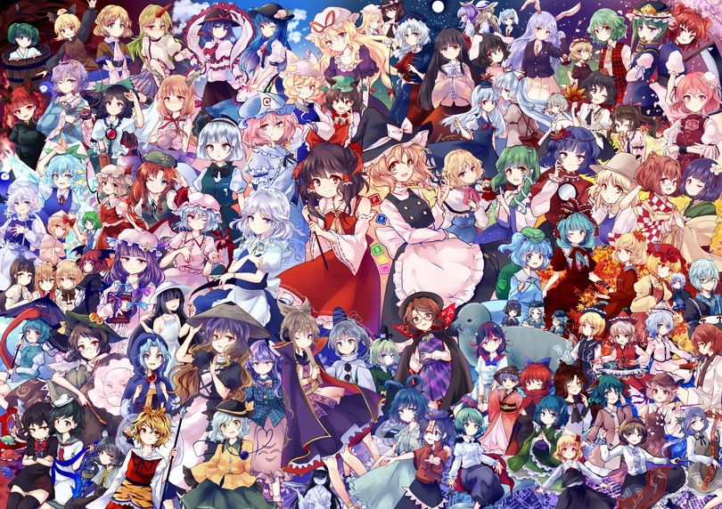

<div align="center">




# Touhou Project: The Linux Preservation Archive

### TH01 — TH08 (Non-Steam Era)

#### <p align="center">
  <b>A collection of classic Touhou Project games, configured to run on Linux.</b><br>
In a couple of minutes
</p>

</div>


## Game List & Status

All games are configured and tested. Click on the title to access the launch instructions.

###  PC-98 Era (1996-1998)
*Requires: `np2kai-git`*

| Ver | Title | Genre |
| :-: | :--- | :---: |
| **TH01** | [**Highly Responsive to Prayers**](Bin/TouhouReiidenTheHighlyResponsivetoPrayers) | Arkanoid |
| **TH02** | [**Story of Eastern Wonderland**](Bin/StoryofEasternWonderland) | Shooter |
| **TH03** | [**Phantasmagoria of Dim.Dream**](Bin/PhantasmagoriaofDimDream) | VS Shooter |
| **TH04** | [**Lotus Land Story**](Bin/LotusLandStory) | Shooter |
| **TH05** | [**Mystic Square**](Bin/MysticSquare) | Shooter |

### Classic Windows Era (2002-2004)
*Requires: `wine-ge-custom`*

| Ver | Title | Focus | 
| :-: | :--- | :---: | 
| **TH06** | [**The Embodiment of Scarlet Devil**](Bin/TouhouEoSD) | VS Shooter  |
| **TH07** | [**Perfect Cherry Blossom**](Bin/PerfectCherryBlossom) | VS Shooter |
| **TH08** | [**Imperishable Night**](Bin/ImperishableNight) | VS Shooter |

---

##  Prerequisites

Make sure you have the necessary tools installed.
### 1. Для PC-98 (TH01 - TH05)
 **Neko Project II Kai**.
```bash
yay -S np2kai-git
```

### 2. Для Windows (TH06 - TH08)
 **Wine-GE**.
```bash
yay -S wine-ge-custom
```

---

## Disclaimer

Проект создан исключительно в целях **сохранения истории видеоигр**.
Игры TH01-TH08 официально не продаются в цифровых магазинах.
Please support **ZUN** and **Team Shanghai Alice** by purchasing available games (TH08+) in [Steam](https://store.steampowered.com/search/?developer=%E4%B8%8A%E6%B5%B7%E3%82%A2%E3%83%AA%E3%82%B9%E5%B9%BB%E6%A8%82%E5%9B%A3&ndl=1).

<div align="center">
  <i>"Girls are now preparing. Please watch warmly until it is ready."</i>
</div>


<div align="center">

**Contact**
- Telegram: [zarazaex](https://t.me/zarazaexe)
- Email: zarazaex@tuta.io
- Site: [zarazaex.xyz](https://zarazaex.xyz)


</div>
